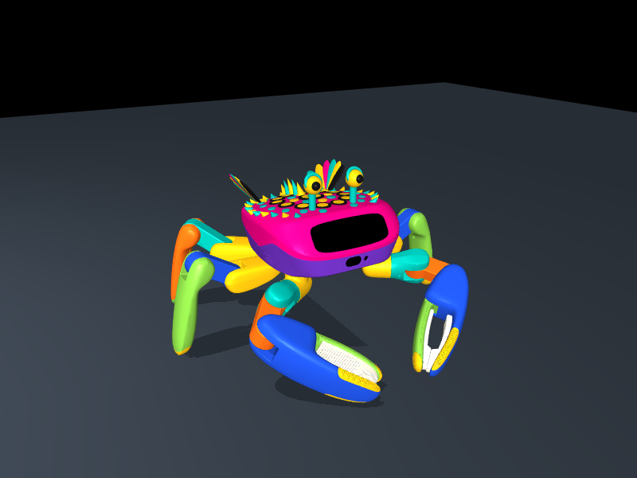

# Jumper Alebrije · Día de Muertos edition

A Mexican folk-art look for [Jumper](https://github.com/KingKongRobotics/jumper), KingKong
Robotics' open-source crab robot, and a Day of the Dead plaza for it to dance in. Our entry
to the [Crab Robot Open Motion Challenge](https://beunlimited.me/en/events/crab-robot-challenge-2026).

By [MADFAM](https://madfam.io), Cuernavaca, Mexico.



## What is here

| Deliverable | What it is | Checked with |
|---|---|---|
| `alebrije-jumper.skin` | Display-only appearance, `kk-skin-package/3`: a pink shell painted with yellow, turquoise and black (dot rings, a sun medallion, a spiny crest, a zigzag crown, feathered wings, eyestalks with big yellow eyes), plus a lacquered rainbow palette on every leg segment | `shellflow verify-package --profile robots/jumper/profile.json --mujoco` → `ok` |
| `dia-de-muertos-plaza.map` | Scene, `kk-scene-package/2`: terracotta tiles, a marigold petal path and ring, a three-tier ofrenda with candles, sugar skulls and pan de muerto, papel picado, bougainvillea on a cobalt adobe wall, a dusk sky. Bundles the alebrije Jumper as its default robot | `shellflow verify-package --capability rigid --capability jumper --mujoco` → `ok` |
| `media/jumper-alebrije-dia-de-muertos.mp4` | 43 s vertical video: the alebrije Jumper dancing KingKong's own trained *Brazilian* and *Dream Wings* policies in the plaza, then bowing | — |

The `.skin` and `.map` are built only with KingKong's own
[jumper-design](https://github.com/KingKongRobotics/jumper-design) toolchain
(`shellflow.simulation.assemble`, `export-skin`, `export_environment`, `verify-package`).
Download them from this repository's Releases, or rebuild them with the steps below.

## How it works

**The look** (`design/alebrije.py`) is generated, not hand-modeled: decorations are ray-cast
onto the real upper-shell mesh and oriented along its surface normals, then merged one mesh per
color. The `.skin` format paints a shell from at most four filament colors (one multi-material
print), so the shell uses exactly four: rosa mexicano, yellow, turquoise and black. The
legs are recolored through the format's per-part `visual_overrides`.

**It is display-only.** Every added geom is massless and non-colliding. Running the same 40 s
dance with the stock robot and with the alebrije robot gives bit-identical trajectories
(maximum `|Δqpos|` = 0.0 over 1,200 frames).

**The motion is KingKong's.** `sim/jumper_sim.py` runs the bundle in
`jumper/out/bundle_example/` without PyTorch, so it works on an Intel Mac or any CPU:

- the bundle's compiled controller (`runtime/mjlab/<platform>/controller.so`) builds every
  observation, switches modes on the bundle's own key bindings and decodes actions;
- its ONNX policies run through onnxruntime;
- MuJoCo steps the robot at 1 kHz with the collision, friction, contact and armature settings
  of `tasks/jumper/common/constants.py` and the servo's measured torque–speed curve from
  `assets/jumper/motor/motor_config.yaml`.

`sim/smoke_test.py` enters all eleven trigger-able modes (four dances, four gestures, jump,
both claws); none tilts past 15°.

**The video** is recorded once (`sim/record.py` saves the pose at 30 fps) and rendered
separately (`render/video.py`), so camera moves and captions can change without re-simulating.

## Rebuild

Python 3.10+. Put KingKong's two repositories next to this one:

```text
workspace/
  jumper/          git clone https://github.com/KingKongRobotics/jumper
  jumper-design/   git clone https://github.com/KingKongRobotics/jumper-design  (with Git LFS files)
  alebrije/        this repository
```

```sh
python -m venv .venv && . .venv/bin/activate
pip install -r alebrije/requirements.txt
pip install -e "jumper-design[sim,dev]"

cd alebrije
python sim/smoke_test.py                       # every mode runs, nobody falls
python skin/build_skin.py                      # -> skin/build/alebrije-jumper.skin (verified)
python scene/build_map.py                      # -> scene/build/dia-de-muertos-plaza.map (verified)
python sim/record.py choreo/take1.json out/take1.npz
python render/video.py out/take1.npz choreo/take1.shots.json out/take1.mp4
```

The `Makefile` wraps the same steps: `make test`, `make dist verify` (rebuild both packages and
re-run KingKong's validator on them), `make video`.

Built against `jumper` @ `61d0652` and `jumper-design` @ `918d192`. MuJoCo 3.10 was used
because it is the last release with Intel-Mac wheels; KingKong's training pins 3.11.

## Limits, stated plainly

- Everything here is simulation. Nothing ran on a physical Jumper.
- The skin is display-only, like every `/3` skin: no mounting interface was engineered and
  nothing was printed or fit-tested (`physical_fit_tested=false` in the package).
- The motions are KingKong's trained policies from the example bundle; we did not train new ones.
- The video has no soundtrack.

## License

Apache-2.0 for the code, the generated meshes and the packages built from them. KingKong's
toolkit, robot model and policies keep their own Apache-2.0 terms and notices; see their
repositories. MuJoCo is Apache-2.0.
